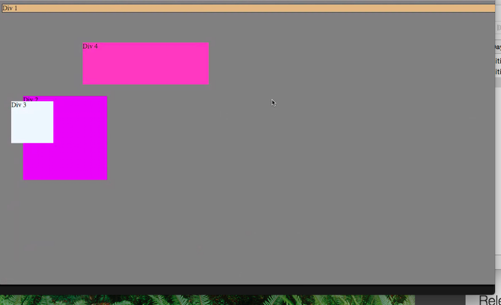
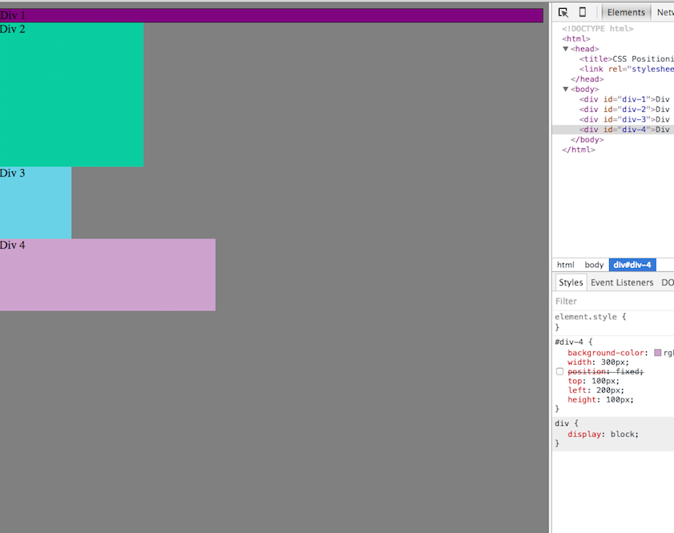
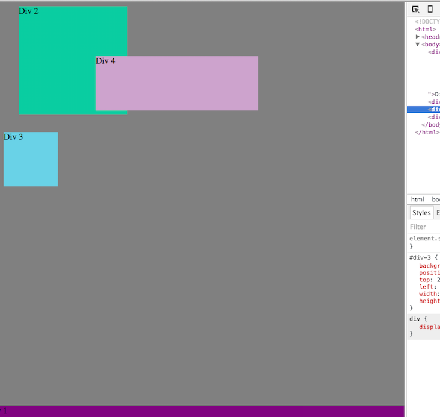
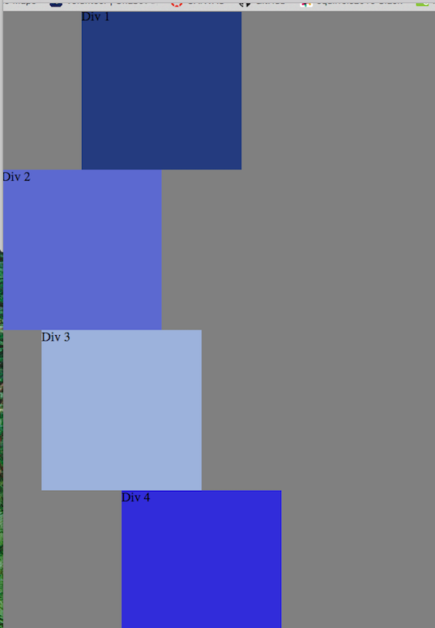
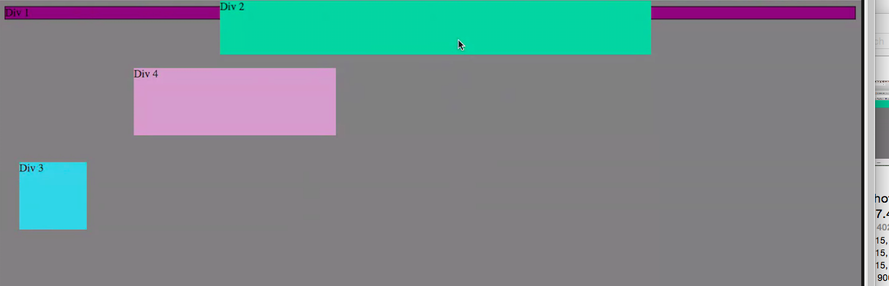
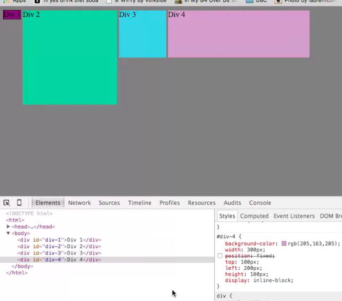

#Positioning Reflection

  *How can you use Chrome's DevTools inspector to help you format or position elements?

    *By utilizing DevTools, so far as I understand it, allows you to inspect the DOM tree, and perform in the moment changes (and see them live in the browser). While it doesn't save these changes, it's a great time-saver to see how your potential optimizations look before you write them out and save them.

  *How can you resize elements on the DOM using CSS?
    *You would simply open DevTools, navigate to the Elements tab, and then change/add CSS elements to alter sizing.

  *What are the differences between absolute, fixed, static, and relative positioning? Which did you find the easiest to use? Which was the most difficult?
   *I found the concept a bit hard to understand for relative positioning, as I'm not following why it moves from where it would be normally? On the other hand, using
    -relative-this position moves in relation to where it otherwise would be, whether top, right, bottom or left.
    -fixed-This positioning does not affect the positioning of other elements, but it does not move when a user scrolls around the page, staying "fixed" in its place.
    -absolute-this positions the element by relation to the containing element, and does not affect surrounding elements. The absolute element will move as users scroll.
    -static-this is also considered "normal flow" and has each block-type element stacked atop one another. The browser treats static position as a sort of default standard that elements are presented.

  *What are the differences between margin, border, and padding?
    *The space that surrounds an element is the "margin". The edge of an element is the "border", and the space between the content or element and the border is the "padding". The Box Model demonstrates the differences in an infographic!

  *What was your impression of this challenge overall? (love, hate, and why?)
    *I found this really entertaining and novel, I honestly didn't know this particular tool's use, so it was fun to play around. I definitely loved the creative portion at the end, as I did that on my own time. I feel this is something I'd use a lot, so I'm glad we were introduced to this tool early on.